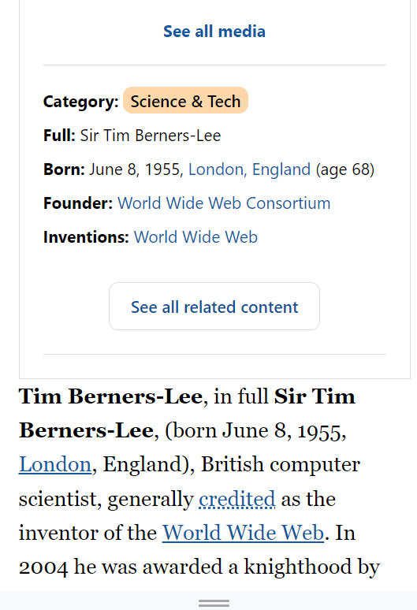
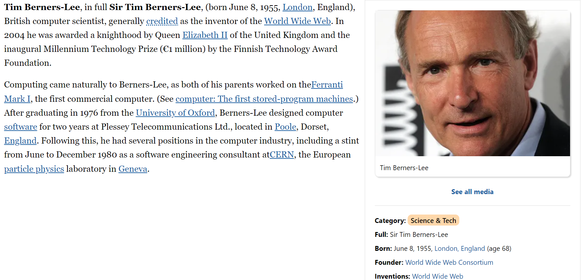

# Picture Perfect - Tim Berners-Lee, Britannica

Dans le cadre de ma formation chez BeCode, j'ai réalisé un "picture perfect" partiellement responsive de l'article de l'Encyclopaedia Britannica sur Tim Berners-Lee.

### Technologies utilisées

HTML, CSS, JavaScript.
Build & Deploy: Vite.js

### Screenshots

### Auteur

Audrius Grebliunas